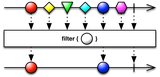
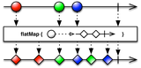

Author Pablo Perez Garcia 

Project to cover the most famous [Spark](https://spark.apache.org/) features.

## Core

Here we cover with some practical examples, the most common use of the Spark Core Functional API

* **Create**

    
    * [Creating](src/test/scala/SparkCreation.scala)

* **Transform**

    
    * [Transforming](src/test/scala/SparkTransform.scala)

* **Filter**

    
    * [Filtering](src/test/scala/SparkFilter.scala)

* **Combine**

    
    * [Combining](src/test/scala/SparkCompose.scala)